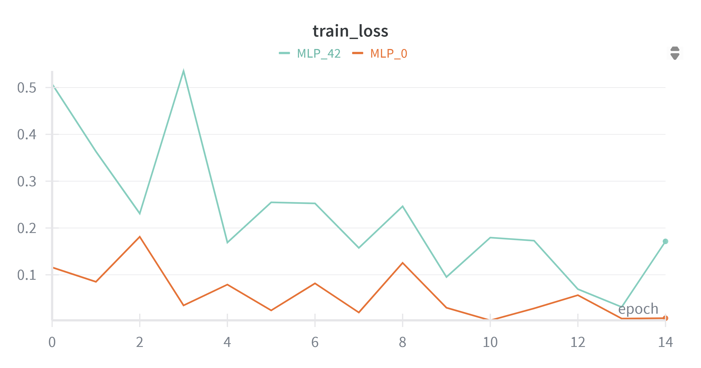
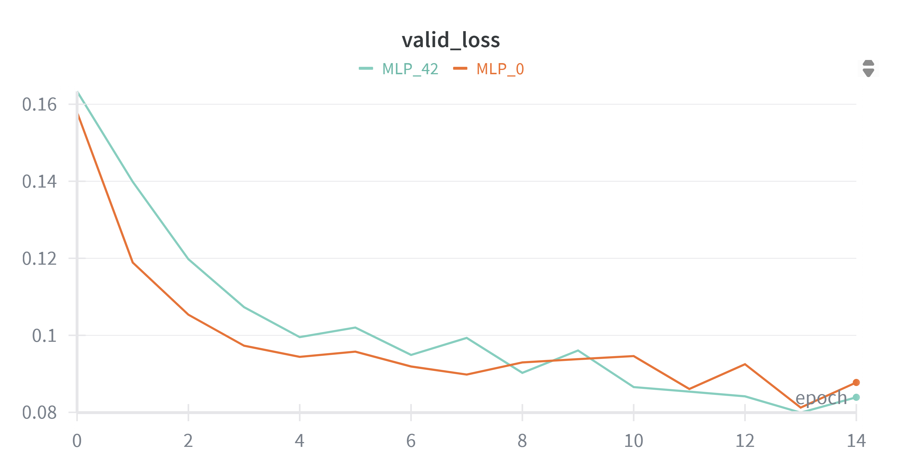
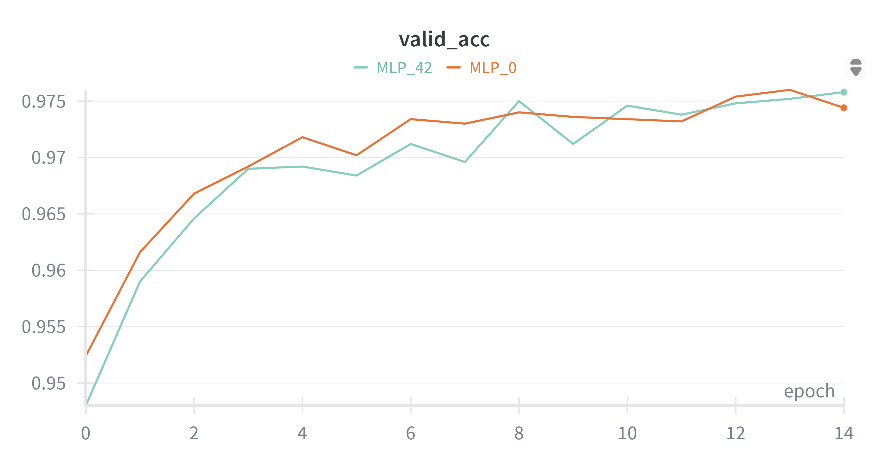
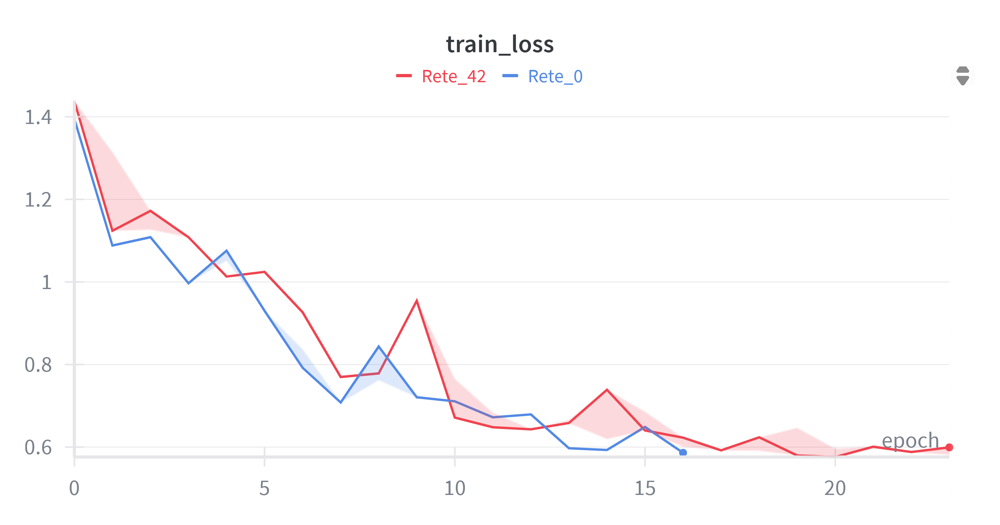
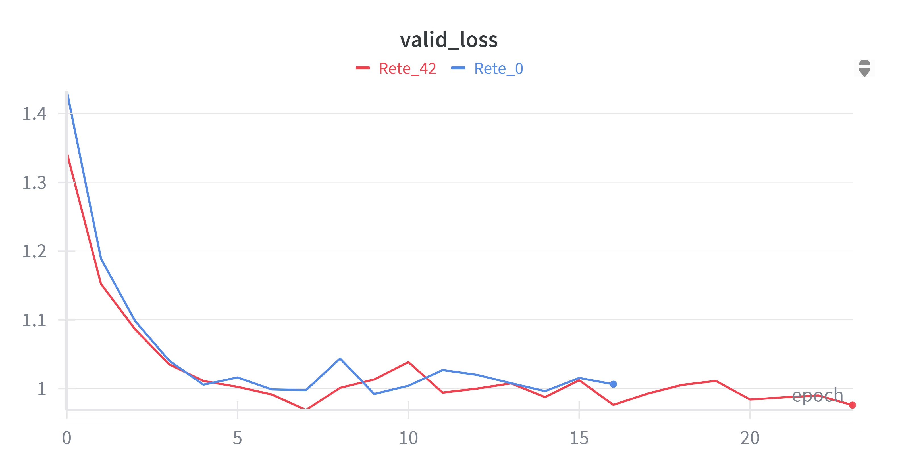
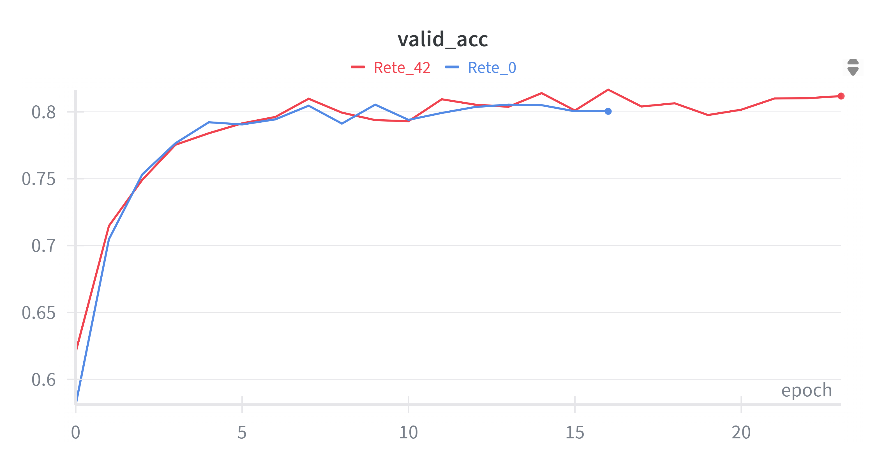

# Guide
This project is structured like so:  
- 1 notebook to train MLP models
- 1 notebook to analyze MLP models
- 2 MLP checkpoints [to download and then load into the files section for the previous notebook if you want to re-run it]
- 1 notebook to train CNN models
- 1 notebook to analyze CNN models
- 2 CNN checkpoints [to download and then load into the files section or the previous notebook if you want to re-run it]
- LateX + bibliography + pictures 

You can find all the links below.  
All the training logging is done with [Weights & Biases](https://wandb.ai/). To re-train just add your own Wandb API key when asked if you have an account, otherwise ignore the request and go on, the best checkpoint and some data is still available but not fully. 

## Training

### MLP Training (MNIST)
- **Architecture:**
  - Input: Flattened 28×28 grayscale images
  - Hidden Layers: 128 → 64 → 64 neurons
    - Each hidden layer: Linear → ReLU → BatchNorm1d → Dropout(0.25)
  - Output Layer: Linear(64 → 10)
- Colab Notebook: [MLP Training Notebook](https://colab.research.google.com/drive/1sJohxZYppV9RlKlP03DBiJ5ztqX80hWm?usp=sharing)

  
  
  

### CNN Training (CIFAR-10)
- **Architecture: CNN5**
  - Feature Extractor:
    1. Conv2d(3 → 32, kernel=3, stride=1, padding=1) → BatchNorm2d(32) → ReLU → MaxPool2d(2)
    2. Conv2d(32 → 64, kernel=3, stride=1, padding=1) → BatchNorm2d(64) → ReLU → MaxPool2d(2)
    3. Conv2d(64 → 128, kernel=3, stride=1, padding=1) → BatchNorm2d(128) → ReLU → MaxPool2d(2)
    4. Conv2d(128 → 256, kernel=3, stride=1, padding=1) → BatchNorm2d(256) → ReLU → MaxPool2d(2)
  - Classifier:
    1. Flatten
    2. Linear(256*2*2 → 512) → ReLU → Dropout(0.5)
    3. Linear(512 → 10)
- Colab Notebook: [CNN Training Notebook](https://colab.research.google.com/drive/1GW5-RtVSWXZ22OIlq3G2DYxXZmSTEJsM?usp=sharing)

  
  
  

## Table of Test-set results

| Model   | Accuracy |   Loss   |
|---------|----------|----------|
| MLP_0   | 0.9784   | 0.072309 |
| MLP_42  | 0.9773   | 0.78174  |
| CNN_0   | 0.7967   | 1.01344  |
| CNN_42  | 0.8113   | 0.99592  |

### Best Checkpoints
- Folder containing the best checkpoints for each model: [here](https://github.com/WrongMedal/ML_proj_Orthogonal_Re-Basin/tree/main/Checkpoints)

---

## Analysis

### MLP Analysis
- Notebook or file: [MLP Analysis Notebook](https://colab.research.google.com/drive/1jt9O1UdaPdMXsPhOC39JVwnN1f-HWERA?usp=sharing)

### CNN Analysis
- Notebook or file: [CNN Analysis Notebook](https://colab.research.google.com/drive/1jU_5wiT7-BbzZOXaz14BmyLS0nrMPKB7?usp=sharing)

